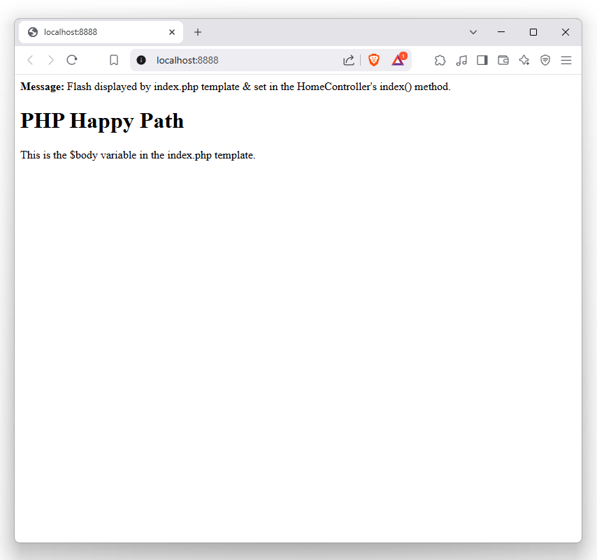

```
 ______  _     _ ______     _     _                            ______           _     
(_____ \| |   | (_____ \   | |   | |                          (_____ \     _   | |    
 _____) ) |__ | |_____) )  | |__ | | ____ ____  ____  _   _    _____) )___| |_ | | _  
|  ____/|  __)| |  ____/   |  __)| |/ _  |  _ \|  _ \| | | |  |  ____/ _  |  _)| || \ 
| |     | |   | | |        | |   | ( ( | | | | | | | | |_| |  | |   ( ( | | |__| | | |
|_|     |_|   |_|_|        |_|   |_|\_||_| ||_/| ||_/ \__  |  |_|    \_||_|\___)_| |_|
                                         |_|   |_|   (____/                           
```

# P.H.P. Happy Path


## v0.0.1
- Added a `ServiceProvider` and related features
- Additional namespaces in `composer.json`
- Adding classless `theme.css` in `_head.php`
- Wiring up `$serviceDiscovery` in `public/index.php`
- Adding Attribute
- Adding `src/Containers/ProviderInterface.php`
- First iteration of `src/Containers/ServiceProvider.php`
- Light maintenance on `src/Controller.php`
- Adding `Route` attribute to `src/Controllers/HomeController.php`
- Database configuration in `src/Models/Database.php`
- Documentation for `src/Router.php`

## v0.0.1

